# 编程概述
## 1.1 主函数（main）

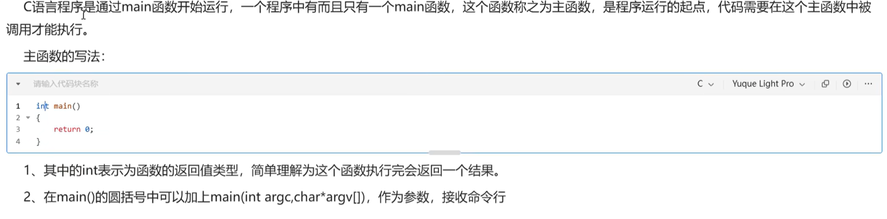

#include<stdio.h> // 工具包

int main() // 主函数
{

    printf("hello c"); // 输出
     
    return 0; // 固定

}  // 框架

argc（个数） argv（是什么）

# 标识符

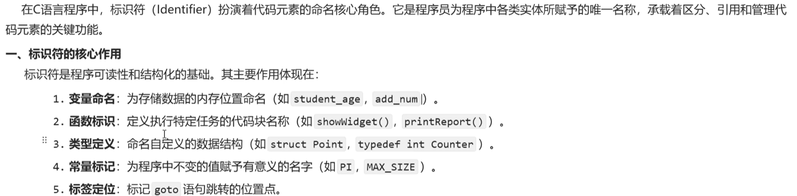

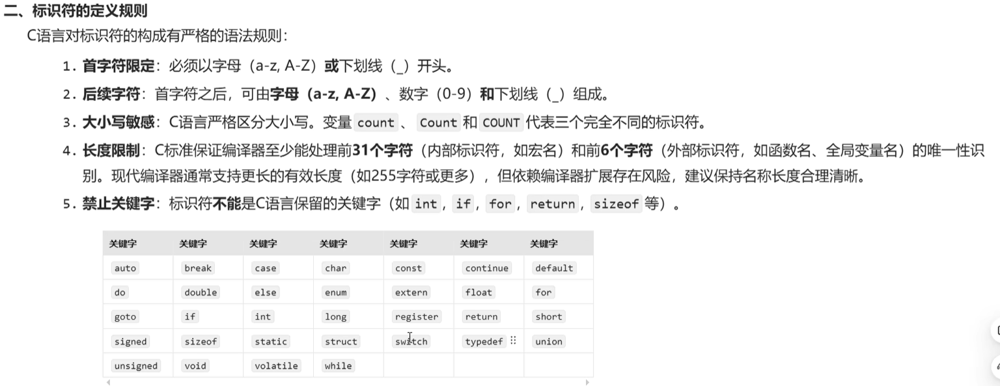

直观理解就是语法或者说规则：便于理解，清晰。

# 基本数据类型__整数

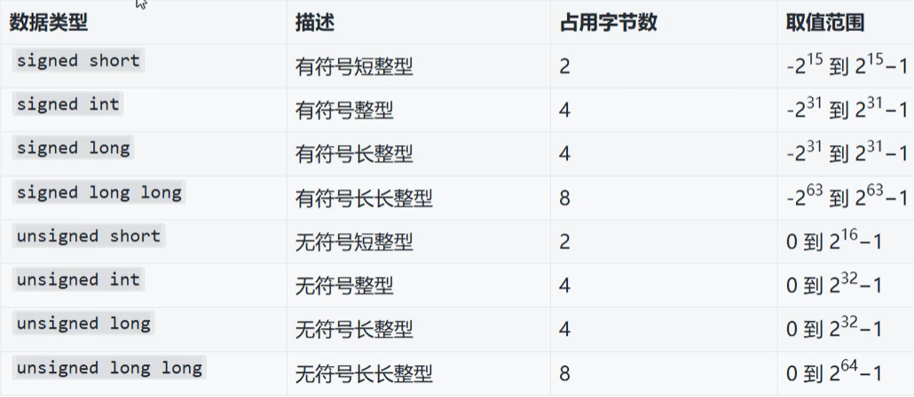

# scanf输入 printf输出

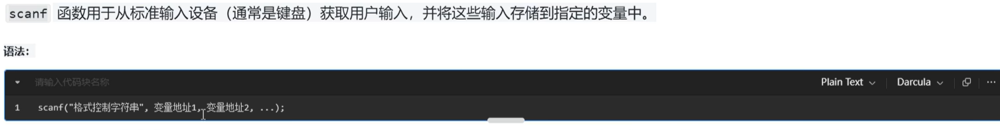

#include <stdio.h>

{
    int a;
    short b;

    scanf("%d %hd",&a,&b);

    printf("int:%d %hd",a,b);
    return 0;
}

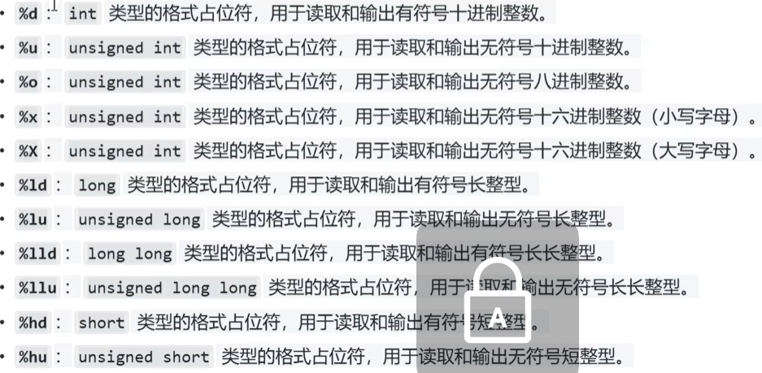

###反思总结：几乎每个字符之间都要空格，注意一些常见拼写。

## 字符型char

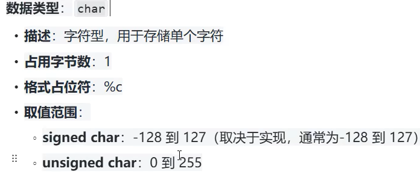

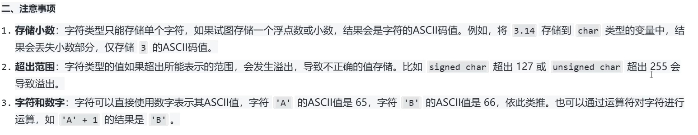

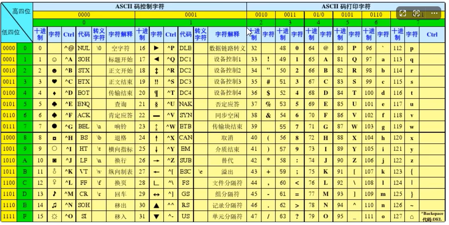

## 小数

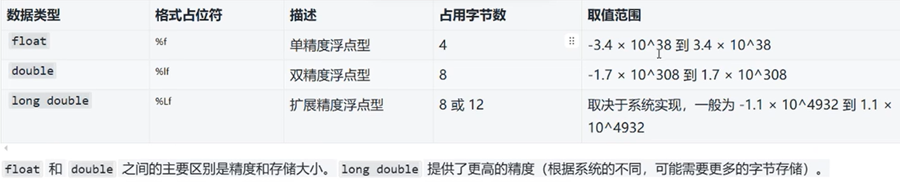

C语言默认7为 在%之后加  .几位就可以了

## 字符总结

 整数加unsigned去负数（d换u）：int(%d),short(%hd),long(%ld),long long(%lld) 
 符号同上: char(%c)
 小数：float(%f),double(%f),long double(%Lf)

 # 运算符

 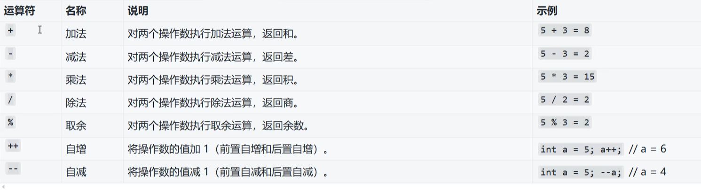

右到左运算
 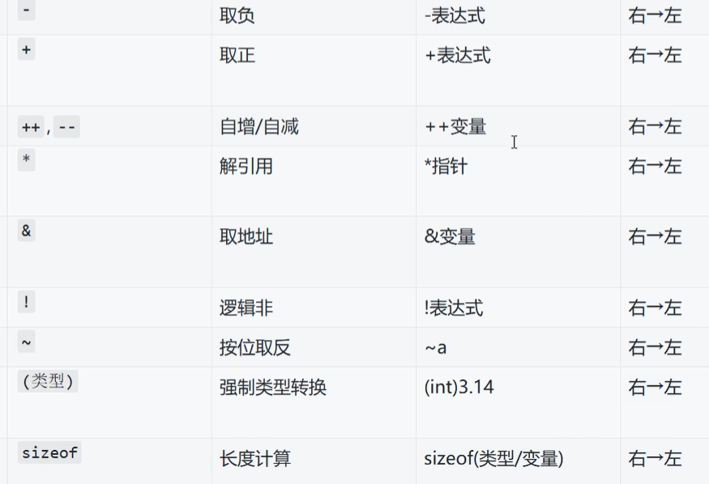

 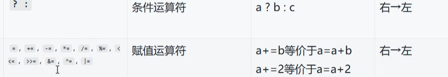

 关系运算符（关系真假结果为1/0）

 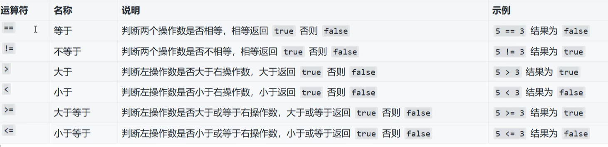

 逻辑运算符

 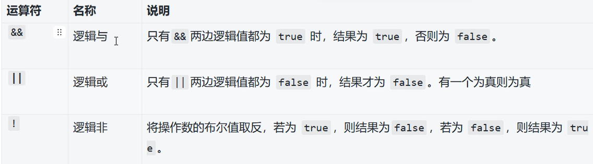

 赋值运算符

 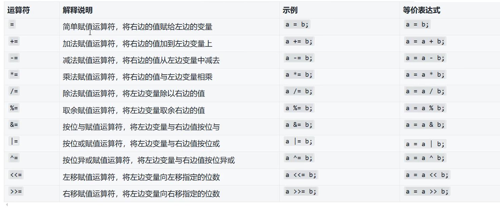

 二进制运算符

 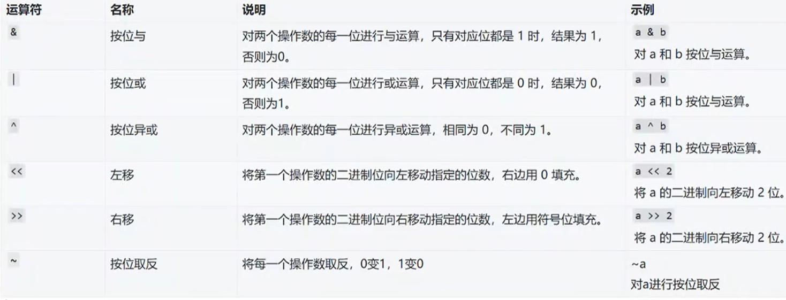

 num |= (1 << n)  // 置一：强制n位为1，其他不变

 mun &= ~(1 << n) // 清零：强制n位为零，其他不变

 num ^= (1 << n) // 反转； 0和1互换其他不变

 # if语句（条件表达）

 if 条件 // 条件为真输出，为假输出

 printf 结果

 else if // 上边的if为假执行这个条件，为真则输出

# switch 语句

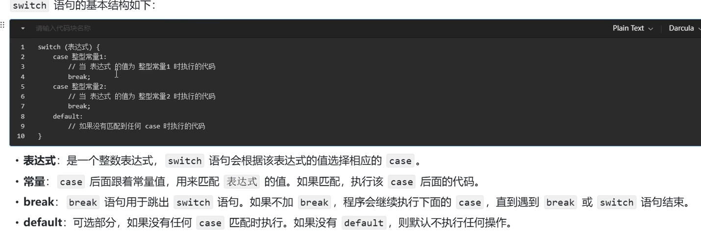